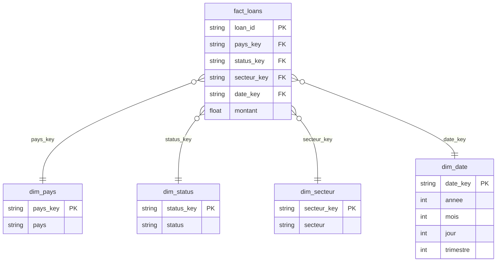

# Schéma en étoile — Kiva loans

Une table de faits au centre, entourée de 4 tables de dimension. La table de faits garde les clés des dimensions, pas l'inverse.

## Pourquoi ce découpage

- `fact_loans` a sa propre clé primaire (`loan_id`), indépendante des dimensions. La combinaison des 4 clés étrangères ne serait pas unique : deux prêts différents peuvent très bien partager le même pays, le même statut, le même secteur et la même date.
- Chaque dimension a sa propre clé, répétée autant de fois que nécessaire dans `fact_loans`. C'est l'inverse d'une clé de faits qui migrerait vers les dimensions — ça casserait la réutilisation (une dimension doit pouvoir être référencée par plein de lignes de faits).
- `dim_date` existe à part plutôt que de garder une date brute dans `fact_loans`, pour permettre des agrégations faciles (par année, par mois, par trimestre) sans recalculer à chaque requête.

## Findex

Pas intégré pour le MVP. Si ajouté plus tard, attention au grain : Findex est probablement à la granularité pays + année, différente de `dim_pays` (un pays = une ligne). Il faudrait soit une dimension séparée, soit vérifier que le grain correspond avant de fusionner des colonnes.
